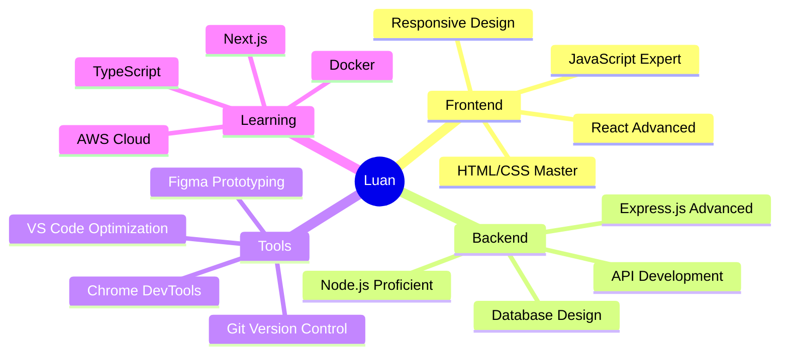

# <div align="center">👋 Xin chào, mình là **Luan** 🚀</div>

<div align="center">
  
</div>

<div align="center">
  
</div>

---

<div align="center">
  
```ascii
╭─────────────────────────────────────────────────────────────╮
│  🎯 Passionate Developer from Vietnam 🇻🇳                    │
│  💡 Turning Ideas into Digital Reality                       │
│  🌟 3+ Years of Coding Experience                           │
│  🚀 Always Pushing Boundaries                               │
╰─────────────────────────────────────────────────────────────╯
```

</div>

## 🛡️ **Tech Arsenal**

<div align="center">

### 🎨 **Frontend Mastery**
[](https://developer.mozilla.org/en-US/docs/Web/HTML)
[](https://developer.mozilla.org/en-US/docs/Web/CSS)
[](https://javascript.info/)
[](https://reactjs.org/)
[](https://tailwindcss.com/)

### ⚙️ **Backend Power**
[](https://nodejs.org/)
[](https://expressjs.com/)
[](https://www.mysql.com/)
[](https://www.mongodb.com/)
[](https://spring.io/projects/spring-boot)

### 🛠️ **DevTools & Workflow**
[](https://code.visualstudio.com/)
[](https://git-scm.com/)
[](https://github.com/)
[](https://www.figma.com/)

</div>

---

## 🚀 **Featured Projects**

<div align="center">
  
<table>
<tr>
<td align="center" width="33%">

### 🛍️ **AnShop**


**Advanced e-commerce solution với real-time cart management và comprehensive admin dashboard**

🔧 `React` `Node.js` `MySQL` `JWT`

[](https://github.com/anvk/anshop)
[](https://github.com/anvk/anshop)

</td>
<td align="center" width="33%">

### ✍️ **BlogIt**


**Modern blogging platform with advanced authentication và seamless content creation**

🔧 `React` `Express` `MongoDB` `Tailwind`

[](https://github.com/anvk/blogit)
[](https://github.com/anvk/blogit)

</td>
<td align="center" width="33%">

### 🔐 **AuthBox**


**Enterprise-grade authentication system với role-based access control**

🔧 `Node.js` `Express` `JWT` `Bcrypt`

[](https://github.com/anvk/authbox)
[](https://github.com/anvk/authbox)

</td>
</tr>
</table>

</div>

---

## 📊 **GitHub Analytics & Performance**

<div align="center">

<table>
<tr>
<td align="center">

</td>
<td align="center">

</td>
</tr>
</table>


</div>

---

## 🎯 **Skill Matrix & Progress**

<div align="center">



</div>

---

## 🌟 **Current Learning Journey**

<div align="center">
  
<table>
<tr>
<td width="50%">

### 🔥 **Active Learning**
```yaml
📚 2024 Roadmap:
├── 🚀 Next.js 14 & App Router
├── 🔒 Advanced Security Practices
├── ☁️ Cloud Architecture (AWS)
├── 🐳 Docker & Containerization
└── 📱 React Native Development
```

</td>
<td width="50%">

### 💡 **Goals & Targets**
```yaml
🎯 Development Goals:
├── 📈 Contribute to Open Source
├── 🏆 Build Production Apps
├── 🎓 Master System Design
├── 🌐 Learn DevOps Practices
└── 👥 Mentor Junior Developers
```

</td>
</tr>
</table>

</div>

---

## 📫 **Let's Connect & Collaborate**

<div align="center">

[](https://www.facebook.com/luan.le.355745)
[](mailto:quangluan03052000@gmail.com)
[](https://github.com/luanPro35)
[](#)

### 💬 **Open for opportunities in:**
`Frontend Development` • `Backend Development` • `Full-Stack Projects` • `Code Review` • `Tech Mentoring`

</div>

---

<div align="center">
  
**💡 "Code is like humor. When you have to explain it, it's bad." - Cory House**


</div>

---

<div align="center">

</div>
